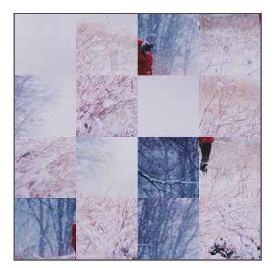
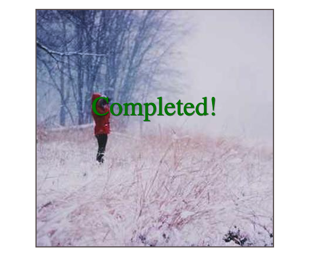
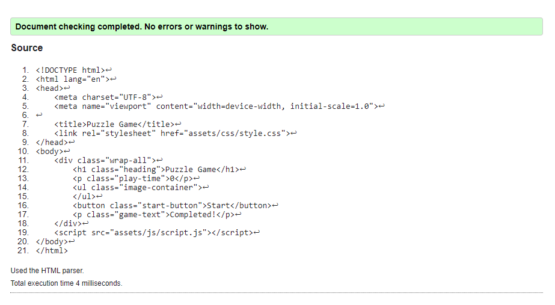
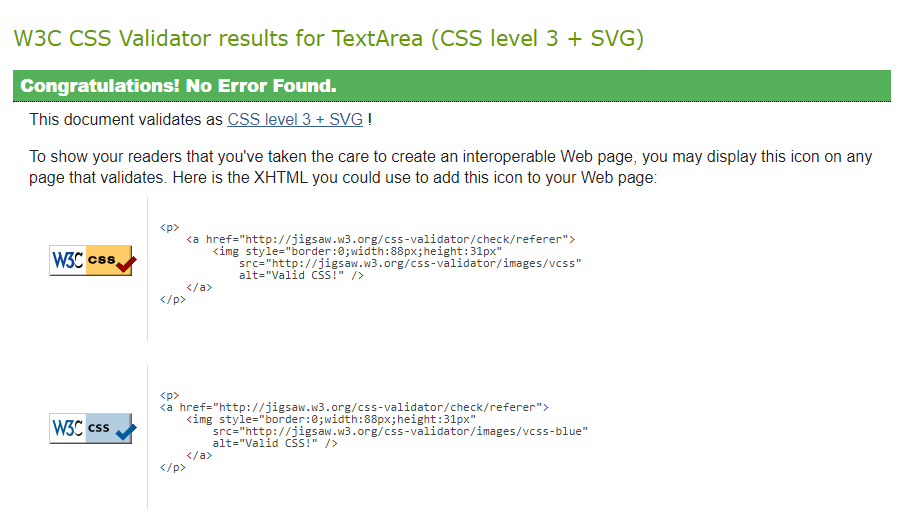
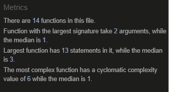
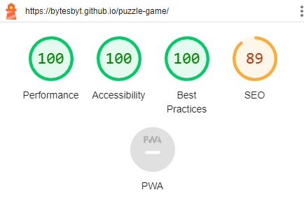

# Puzzle Game

Puzzle Game is online puzzle game site which provides infinate puzzle images for people to complete.

The site will be targeted toward people who wants to improve their brain muscles and increase problem solving skills.

- Mockup Image [Am I Responsive?](https://ui.dev/amiresponsive)

## Features 

### Existing Features

- __The Puzzle Game Heading__

  - Featured at the top of the page, the Puzzle Game heading is easy to see for the users. Upon entering the page, the user will be able to see the name of the game.

- __The Time Count__

  - This section will allow the user to see how many seconds it takes them to complete the puzzle.
  - Time count will start 3 seconds after start button have been clicked by the user. 
  - First 3 seconds will allow user to see the completed image.

- __The Main Game Area__

  - The puzzle section will show complete image once start button is pressed by the user.
  - After 3 seconds image will be shown in 16 mixed tiles.
  - The user can drag and drop the tiles anywhere within the game area to complete the puzzle image.

- __The Start Button__

  - This section will allow the user to start the game by clicking on the start button. 

- __The Complete Sign__

  - This sign at the end of the game will allow the user to know when the puzzle is completed. 

### Features Left to Implement

In the future I will implement a feature that allows the user to access the completed image while the puzzle game is being played.

## Testing 

- Puzzle Game works in different browsers: Chrome, Firefox, Safari.
- This page is responsive, looks good on all standard screen sizes using the devtool device toolbar.

### Validator Testing 

- HTML
    - No errors were returned when passing through the official [W3C validator](https://validator.w3.org/nu/?doc=https%3A%2F%2Fcode-institute-org.github.io%2Flove-maths%2F)

- CSS
    - No errors were found when passing through the official [(Jigsaw) validator](https://jigsaw.w3.org/css-validator/#validate_by_uri)

- JavaScript
    - No errors were found when passing through the official [Jshint validator](https://jshint.com/)
      - The following metrics were returned: 
      - There are 14 functions in this file.
      - Function with the largest signature take 2 arguments, while the median is 1.
      - Largest function has 13 statements in it, while the median is 3.
      - The most complex function has a cyclomatic complexity value of 6 while the median is 1.

- Accessibility
    - Chosen colors are easy yo read and accessible by running it through lighthouse in devtools.

### Unfixed Bugs

The drag and drop event in Javascript does not work on touchscreen. Touch event in Javascript will be implemented in the future.

## Deployment

- The site was deployed to GitHub pages. The steps to deploy are as follows: 
  - In the GitHub repository, navigate to the Settings tab 
  - From the source section drop-down menu, select the Master Branch
  - Once the master branch has been selected, the page will be automatically refreshed with a detailed ribbon display to indicate the successful deployment. 

The live link can be found here - https://bytesbyt.github.io/puzzle-game/

## Credits 

### Content 

- Javascript game referce [Code Institute Love-Maths](https://learn.codeinstitute.net/courses/course-v1:CodeInstitute+LM101+2021_T1/courseware/2d651bf3f23e48aeb9b9218871912b2e/234519d86b76411aa181e76a55dabe70/)

### Media

- The images used for the puzzle game [Lorem Picsum](https://picsum.photos/)
- Mockup Image [Am I Responsive?](https://ui.dev/amiresponsive)